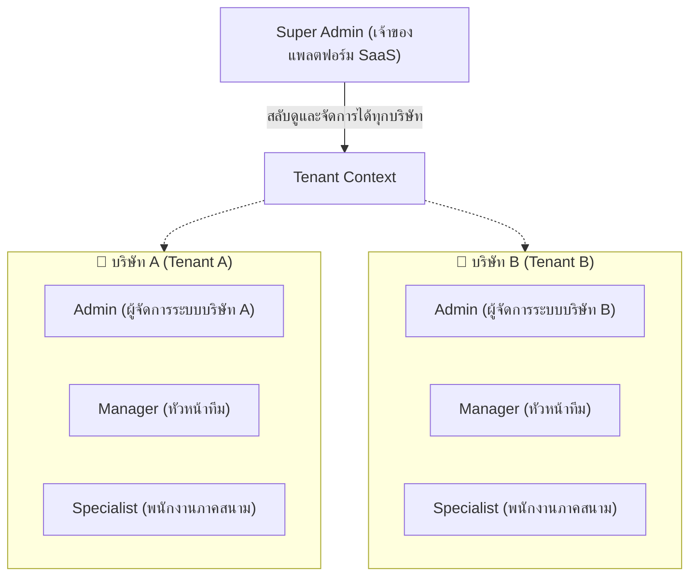
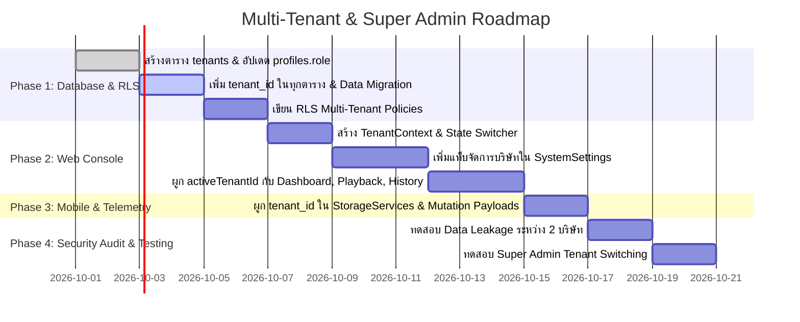

# FastFleet - Multi-Tenant Architecture & Super Admin Implementation Plan
> **Document Version:** 1.0.0  
> **Target Status:** Proposed / Ready for Future Implementation  
> **Platform Scope:** Web Console (`apps/web`), Mobile App (`apps/mobile`), Database (`Supabase / PostgreSQL`)

---

## 1. Executive Summary & Business Objectives

FastFleet ปัจจุบันถูกพัฒนาขึ้นในรูปแบบ **Single-Tenant (ระบบบริษัทเดียว)** ซึ่งจำกัดความสามารถในการขายซอฟต์แวร์ในรูปแบบ B2B SaaS (Software-as-a-Service) ให้กับหลายบริษัทลูกค้า

เอกสารฉบับนี้กำหนดกรอบความต้องการ (Requirements) และสถาปัตยกรรม (Architecture Plan) เพื่อยกระดับระบบเป็น **Multi-Tenant Platform** ที่รองรับ:
1. **Multi-Tenancy Isolation:** แต่ละบริษัทลูกค้า (Tenant) จะมีข้อมูลแยกจากกันโดยเด็ดขาด 100% ไม่สามารถมองเห็นหรือแก้ไขข้อมูลข้ามบริษัทได้
2. **Super Admin Role:** มีผู้ดูแลระบบระดับแพลตฟอร์ม (SaaS Platform Owner) ที่สามารถ:
   - ดูภาพรวมและรายชื่อบริษัทลูกค้าทั้งหมด
   - สามารถเลือกสลับบริษัท (Tenant Switcher) ได้จากหน้า Settings หรือ Top Bar เพื่อเข้าดูข้อมูล (Dashboard, เส้นทาง, แผนงาน, ทีมงาน) เสมือนเป็นแอดมินของบริษัทนั้นๆ
   - จัดการสร้างบริษัทใหม่ (Onboarding) และเปิด/ปิดการใช้งานบริษัท (Active/Suspended)
3. **Seamless Mobile Experience:** พนักงานภาคสนาม (Specialist) ล็อกอินใช้งานตามปกติ โดยระบบผูกข้อมูลเข้ากับบริษัทต้นสังกัดโดยอัตโนมัติ ไม่ต้องเลือกบริษัทเอง

---

## 2. User Roles & Permission Hierarchy

ระบบจะปรับบทบาทผู้ใช้ใหม่เป็น 4 ลำดับขั้น:



| บทบาท (Role) | ขอบเขตการมองเห็น (Scope) | ความสามารถหลัก |
| :--- | :--- | :--- |
| **`super_admin`** | **ทุกบริษัทในระบบ (Global)** | - สลับเลือกดูข้อมูลบริษัทใดก็ได้ (Tenant Switcher)<br>- สร้าง/แก้ไข/ระงับบริษัทลูกค้าในหน้า Settings<br>- กำหนดเพดานผู้ใช้งาน/ฟีเจอร์ของแต่ละบริษัท |
| **`admin`** | **เฉพาะบริษัทตนเอง (Tenant-scoped)** | - จัดการพนักงานการตลาด ยานพาหนะ และแผนกในบริษัท<br>- ดูรายงานวิเคราะห์และ Dashboard ทั้งบริษัท<br>- ตั้งค่าระบบของบริษัทตนเอง (System Settings) |
| **`manager`** | **เฉพาะบริษัทตนเอง (Tenant-scoped)** | - ดูปฏิทินงาน ติดตามพิกัดสด และตรวจเส้นทางย้อนหลัง<br>- ตรวจสอบและอนุมัติ/ส่งกลับแก้ไขทริปงานและค่าใช้จ่าย |
| **`specialist`** | **เฉพาะงานของตนเองในบริษัท (Self-scoped)** | - ใช้งานแอปมือถือ: บันทึกทริป, เช็คอิน Drop, อัปโหลดสลิป<br>- เว็บไซต์: เห็นเฉพาะพิกัดสด แผนงาน และประวัติตนเอง |

---

## 3. Database Schema & Migration Specification

### 3.1 ตารางใหม่: `tenants` (บริษัทลูกค้า)

```sql
CREATE TABLE IF NOT EXISTS public.tenants (
    id UUID PRIMARY KEY DEFAULT uuid_generate_v4(),
    slug TEXT NOT NULL UNIQUE,                       -- เช่น 'logistics-pro', 'fast-delivery'
    name TEXT NOT NULL,                              -- เช่น 'Logistics Pro Thailand Ltd.'
    tax_id TEXT,                                     -- เลขประจำตัวผู้เสียภาษี
    contact_name TEXT,
    contact_email TEXT NOT NULL,
    contact_phone TEXT,
    logo_url TEXT,
    status TEXT NOT NULL DEFAULT 'active' CHECK (status IN ('active', 'inactive', 'suspended')),
    subscription_plan TEXT NOT NULL DEFAULT 'standard' CHECK (subscription_plan IN ('trial', 'standard', 'enterprise')),
    max_specialists INTEGER DEFAULT 50,
    created_at TIMESTAMPTZ NOT NULL DEFAULT NOW(),
    updated_at TIMESTAMPTZ NOT NULL DEFAULT NOW()
);

-- Index เพื่อความรวดเร็วในการ Query
CREATE INDEX IF NOT EXISTS idx_tenants_status ON public.tenants(status);
CREATE INDEX IF NOT EXISTS idx_tenants_slug ON public.tenants(slug);
```

### 3.2 ปรับปรุงตารางผู้ใช้: `profiles`

```sql
-- 1. อัปเดต Check constraint ของ role ให้รองรับ 'super_admin'
ALTER TABLE public.profiles DROP CONSTRAINT IF EXISTS profiles_role_check;
ALTER TABLE public.profiles ADD CONSTRAINT profiles_role_check 
    CHECK (role IN ('super_admin', 'admin', 'manager', 'specialist'));

-- 2. เพิ่ม tenant_id (Super Admin สามารถเป็น NULL ได้ ส่วน role อื่นต้องระบุ)
ALTER TABLE public.profiles ADD COLUMN IF NOT EXISTS tenant_id UUID REFERENCES public.tenants(id) ON DELETE RESTRICT;

CREATE INDEX IF NOT EXISTS idx_profiles_tenant_id ON public.profiles(tenant_id);
```

### 3.3 ผูก `tenant_id` ในทุกตารางข้อมูล (Foreign Keys & Indexes)

ทุกตารางข้อมูลจะต้องมี `tenant_id` เพื่อรองรับการแยกข้อมูลเด็ดขาด:

```sql
-- 1. Departments
ALTER TABLE public.departments ADD COLUMN IF NOT EXISTS tenant_id UUID REFERENCES public.tenants(id) ON DELETE CASCADE;
CREATE INDEX IF NOT EXISTS idx_departments_tenant_id ON public.departments(tenant_id);

-- 2. Trips
ALTER TABLE public.trips ALTER COLUMN tenant_id TYPE UUID USING tenant_id::UUID;
ALTER TABLE public.trips ADD CONSTRAINT fk_trips_tenant FOREIGN KEY (tenant_id) REFERENCES public.tenants(id) ON DELETE CASCADE;
CREATE INDEX IF NOT EXISTS idx_trips_tenant_id ON public.trips(tenant_id);

-- 3. Appointments (Client Drops)
ALTER TABLE public.appointments ALTER COLUMN tenant_id TYPE UUID USING tenant_id::UUID;
ALTER TABLE public.appointments ADD CONSTRAINT fk_appointments_tenant FOREIGN KEY (tenant_id) REFERENCES public.tenants(id) ON DELETE CASCADE;
CREATE INDEX IF NOT EXISTS idx_appointments_tenant_id ON public.appointments(tenant_id);

-- 4. Expenses
ALTER TABLE public.expenses ADD COLUMN IF NOT EXISTS tenant_id UUID REFERENCES public.tenants(id) ON DELETE CASCADE;
CREATE INDEX IF NOT EXISTS idx_expenses_tenant_id ON public.expenses(tenant_id);

-- 5. Location Logs
ALTER TABLE public.location_logs ADD COLUMN IF NOT EXISTS tenant_id UUID REFERENCES public.tenants(id) ON DELETE CASCADE;
CREATE INDEX IF NOT EXISTS idx_location_logs_tenant_id ON public.location_logs(tenant_id);

-- 6. System Settings (แยกการตั้งค่ารายบริษัท)
ALTER TABLE public.system_settings ADD CONSTRAINT fk_system_settings_tenant FOREIGN KEY (tenant_id) REFERENCES public.tenants(id) ON DELETE CASCADE;
CREATE UNIQUE INDEX IF NOT EXISTS uq_system_settings_tenant ON public.system_settings(tenant_id);
```

### 3.4 ข้อมูลเริ่มต้นและการย้ายข้อมูลเดิม (Data Migration Blueprint)

```sql
-- สร้าง Default Tenant สำหรับข้อมูลเดิมที่มีอยู่ในระบบ
INSERT INTO public.tenants (id, slug, name, contact_email, status, subscription_plan)
VALUES (
    '11111111-1111-1111-1111-111111111111',
    'default-org',
    'Logistics Pro Thailand Ltd.',
    'admin@fastfleet.io',
    'active',
    'enterprise'
) ON CONFLICT (id) DO NOTHING;

-- ผูกข้อมูลเดิมทั้งหมดเข้ากับ Default Tenant
UPDATE public.profiles SET tenant_id = '11111111-1111-1111-1111-111111111111' WHERE tenant_id IS NULL AND role != 'super_admin';
UPDATE public.departments SET tenant_id = '11111111-1111-1111-1111-111111111111' WHERE tenant_id IS NULL;
UPDATE public.trips SET tenant_id = '11111111-1111-1111-1111-111111111111' WHERE tenant_id IS NULL;
UPDATE public.appointments SET tenant_id = '11111111-1111-1111-1111-111111111111' WHERE tenant_id IS NULL;
UPDATE public.expenses SET tenant_id = '11111111-1111-1111-1111-111111111111' WHERE tenant_id IS NULL;
UPDATE public.location_logs SET tenant_id = '11111111-1111-1111-1111-111111111111' WHERE tenant_id IS NULL;
UPDATE public.system_settings SET tenant_id = '11111111-1111-1111-1111-111111111111' WHERE tenant_id IS NULL;
```

---

## 4. Row Level Security (RLS) & Multi-Tenant Enforcement

ความปลอดภัยต้องถูกคุมที่ระดับ Database Engine เสมอ เพื่อป้องกันไม่ให้ข้อมูลรั่วไหลแม้ยิง API ตรง

```sql
-- Helper function ตรวจสอบบทบาท Super Admin
CREATE OR REPLACE FUNCTION public.is_super_admin()
RETURNS BOOLEAN AS $$
BEGIN
    RETURN EXISTS (
        SELECT 1 FROM public.profiles
        WHERE id = auth.uid() AND role = 'super_admin'
    );
END;
$$ LANGUAGE plpgsql SECURITY DEFINER;

-- Helper function ดึง tenant_id ของผู้ใช้ปัจจุบัน
CREATE OR REPLACE FUNCTION public.current_user_tenant_id()
RETURNS UUID AS $$
BEGIN
    RETURN (
        SELECT tenant_id FROM public.profiles
        WHERE id = auth.uid()
    );
END;
$$ LANGUAGE plpgsql SECURITY DEFINER;

-- =====================================================================
-- ตัวอย่าง RLS Policies สำหรับ Trips (Data Isolation)
-- =====================================================================
DROP POLICY IF EXISTS "Trips access policy" ON public.trips;

CREATE POLICY "Trips tenant isolation policy" ON public.trips
FOR ALL TO authenticated
USING (
    public.is_super_admin()
    OR (
        tenant_id = public.current_user_tenant_id()
        AND (
            public.is_admin() OR staff_id = auth.uid()
        )
    )
)
WITH CHECK (
    public.is_super_admin()
    OR (
        tenant_id = public.current_user_tenant_id()
        AND (
            public.is_admin() OR staff_id = auth.uid()
        )
    )
);
```

---

## 5. Web Console Specifications (`apps/web`)

### 5.1 Super Admin Tenant Switcher (ในหน้า Settings & Header)

1. **State Management (`TenantContext.tsx`):**
   - จัดการ State `activeTenantId` และ `tenantList`
   - เมื่อล็อกอินเป็น `super_admin`:
     - ดึงรายชื่อ Tenants ทั้งหมดจากตาราง `tenants`
     - มี Dropdown ใน Header/Sidebar หรือในหน้า **ตั้งค่าระบบ (`SystemSettings.tsx`)** ให้เลือกบริษัท
     - ค่าที่เลือกจะถูกบันทึกลง `localStorage` (`fastfleet_active_tenant_id`)
   - เมื่อล็อกอินเป็น `admin` / `specialist`:
     - `activeTenantId` จะถูกล็อกตาม `profiles.tenant_id` โดยไม่แสดง Dropdown สลับบริษัท
2. **หน้าการตั้งค่าระบบ (`SystemSettings.tsx`):**
   - เพิ่มแท็บใหม่: **"จัดการองค์กร/บริษัท (Company Management)"** (แสดงเฉพาะเมื่อเป็น `super_admin`)
   - ความสามารถในแท็บ:
     - แสดงตารางรายชื่อบริษัท พร้อมจำนวน Specialist, ทริปสะสม, สถานะ (Active / Suspended)
     - ปุ่ม **"เพิ่มบริษัทใหม่ (+ Add Company)"** สำหรับสร้าง Tenant ใหม่
     - ปุ่ม **"สลับไปดูบริษัทนี้ (Switch Tenant)"** เมื่อคลิก ระบบจะรีเฟรชข้อมูลหน้าอื่นๆ เป็นของบริษัทนั้นทันที
     - แก้ไขข้อมูลบริษัท โลโก้ และตั้งค่าแพ็กเกจ (Trial / Standard / Enterprise)

### 5.2 การกรองข้อมูลในทุกหน้าของ Web Admin

ทุกหน้าที่มีการ Query ข้อมูลจาก Supabase จะต้องเพิ่มฟิลเตอร์ `tenant_id`:
```typescript
// ตัวอย่าง Pattern การ Query เมื่อมี Tenant Context
let query = supabase.from('trips').select('*');

if (userRole === 'super_admin' && activeTenantId) {
  query = query.eq('tenant_id', activeTenantId);
} else if (userRole !== 'super_admin') {
  query = query.eq('tenant_id', currentTenantId);
}
```

---

## 6. Mobile Application Specifications (`apps/mobile`)

ฝั่ง Mobile Application ไม่จำเป็นต้องมีหน้าจอเลือกบริษัท เพื่อความสะดวกและปลอดภัยสูงสุด:
1. **Auto-Bind ตอน Login:** เมื่อ Specialist ล็อกอินผ่านหน้าจอแอป แอปจะเก็บ `tenant_id` จากข้อมูล `profile` ไว้ใน Storage Service
2. **Auto-Stamp ในทุก Transaction:**
   - การสร้างทริปใหม่ (`trips.insert`)
   - การบันทึก Drop / ลูกค้า (`appointments.insert`)
   - การส่งพิกัด Telemetry / Background Ping (`location_logs.insert`)
   - การบันทึกสลิปค่าใช้จ่าย (`expenses.insert`)
   - ทุกคำสั่ง Insert จะถูกแนบ `tenant_id` ของตนเองไปด้วยเสมอ

---

## 7. แผนการดำเนินการแบ่งตามระยะ (Implementation Roadmap)



### รายละเอียดแต่ละระยะ (Phases):
- **Phase 1: ฐานข้อมูลและความปลอดภัย (Database & RLS)**
  - Execute DDL: สร้างตาราง `tenants`, ปรับปรุง `profiles`, ผูก `tenant_id`
  - ทำ Data Migration ข้อมูลเดิมเข้า Default Tenant
  - ติดตั้ง RLS Multi-tenant บน Supabase
- **Phase 2: ฝั่ง Web Console (Super Admin & Tenant Switcher)**
  - สร้าง `TenantContext` สำหรับแชร์ Active Tenant ข้าม Component
  - พัฒนาหน้าจอสร้างและเลือกบริษัทใน `SystemSettings.tsx`
  - ปรับปรุง `Dashboard.tsx`, `RoutePlayback.tsx`, `VisitHistory.tsx`, `SpecialistScheduleCalendar.tsx`, `DriverManagement.tsx` ให้กรองตาม `activeTenantId`
- **Phase 3: ฝั่ง Mobile App**
  - อัปเดต `storageServices.ts` และการเรียก Supabase ให้แนบ `tenant_id`
- **Phase 4: การทดสอบและการตรวจรับ (Verification & Testing)**
  - ทดสอบสร้างบริษัท A และ บริษัท B
  - ตรวจสอบว่า Admin บริษัท A ไม่สามารถมองเห็นข้อมูลและพิกัดรถของบริษัท B
  - ทดสอบให้ Super Admin สลับดูบริษัท A และ B ผ่านหน้า Settings ได้อย่างถูกต้อง

---

## 8. สรุปความพร้อม (Readiness & Next Step)

เอกสารฉบับนี้ถูกบันทึกไว้ในระบบเพื่อเป็นคู่มือและพิมพ์เขียว (Blueprint) เมื่อถึงเวลาที่พร้อมเริ่มทำจริง สามารถหยิบหัวข้อจากเอกสารนี้มาสร้าง Migration และพัฒนาโค้ดตามลำดับ Phase ได้ทันทีโดยไม่กระทบโครงสร้างปัจจุบันครับ
